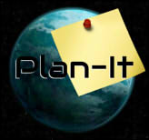
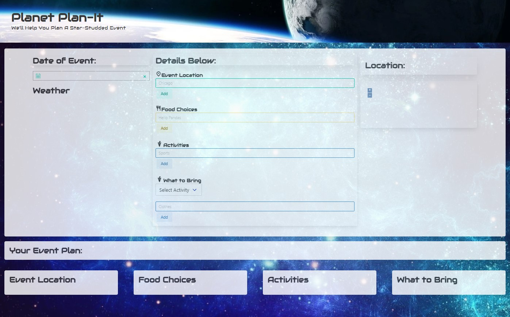

# 
# Planet Plan-it
---

## Project #1 - Team 7  😎 Squirtle Squad

## Introduction: 

This application was built to help event planners for small to medium sized companies easily create a business event. It gives the user the ability to confirm the main details of their event like, the Location, food catering, weather for the event, recommended clothing and accessories for guests. The user is given a map for the area and a current weather outlook. After taking into account the user inputs, the app will create an event outline and store it for future reference and potential updates. 

## Highlights:

The event planner was built using the Bulma CSS framework and a variety of API's. The Open Weather API was utilized to update realtime weather for the event created by the user. The Arcgis and OpenLayers API worked together to give the user a map of the location for the event. The last two API's  
#
### The following API's:
1. OpenWeather API
2. Arcgis Location API
3. OpenLayers API
4. Google Fonts API
5. Moment API

### Images here: 

The Image here represents an example of a few saved schedule events. 

## Summary: 

This is a great tool for every company Event Planner to build a simple yet detailed outline of an upcoming event. They can create events for training, or to honor an important company anniversary, announce new products or services. They can use the app to recognize their best employees.

Future developements will include popular restaurants near your intended event location for less formal or shorter events. With larger events you will get a list of suggested venues and most likely activities based on that venue(outdoor/Indoor). Other useful planning will include the implementation of emailed itenarary for users along with reminders. 

--- 
**Check out the web page below:**
##
[Event Planner](https://think-again-coder.github.io/EventPlanner/) <---- Click Here!
## 
### - Brought to you by the Squirtle Squad - 

Anhvu, Emma, Dylan, John, and David

